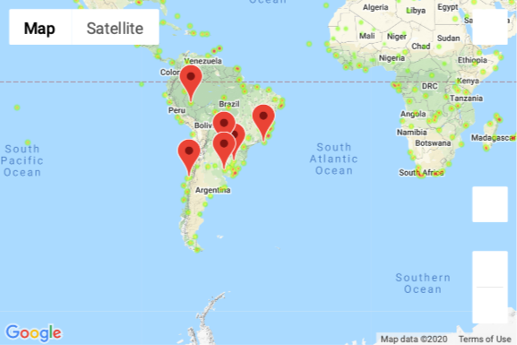

# What's the Weather Like?

## Background

The repo contains two notebooks WeatherPy- explores the way weather changes as we approach the equator - and VacationPy - plan future vacations given ideal weather conditions worldwide - . I used Pandas, Numpy, Scipy, JSON, Matplotlib, Requests, CitiPy api and Google API (Geoplaces API, GMAP API) to accomplish my task.

### Part I - WeatherPy

Created a Python script to visualize the weather of 500+ cities across the world of varying distance from the equator. Utilized a [simple Python library](https://pypi.python.org/pypi/citipy), the [OpenWeatherMap API](https://openweathermap.org/api), and some data filtering to create a representative model of weather across world cities.

* First Objective was to build a series of scatter plots to showcase various relationships:

* Second objective was to run linear regression on each relationship, only this time separating them into Northern Hemisphere (greater than or equal to 0 degrees latitude) and Southern Hemisphere (less than 0 degrees latitude):

### Part II - VacationPy

Used jupyter-gmaps and the Google Places API to plan future vacations.

* Created a heat map that displays the humidity for every city from the WeatherPy notebook.
  
* Filtered the dataframe to find ideal weather
  * A max temperature lower than 80 degrees but higher than 70.
  * Wind speed less than 10 mph.
  * Zero cloudiness.
  
* Used Google Places API to find the first hotel for each city located within 5000 meters of the coordinates in the dataframe.

* Created a map of the hotels on top of the humidity heatmap with each pin containing the **Hotel Name**, **City**, and **Country**.

  

